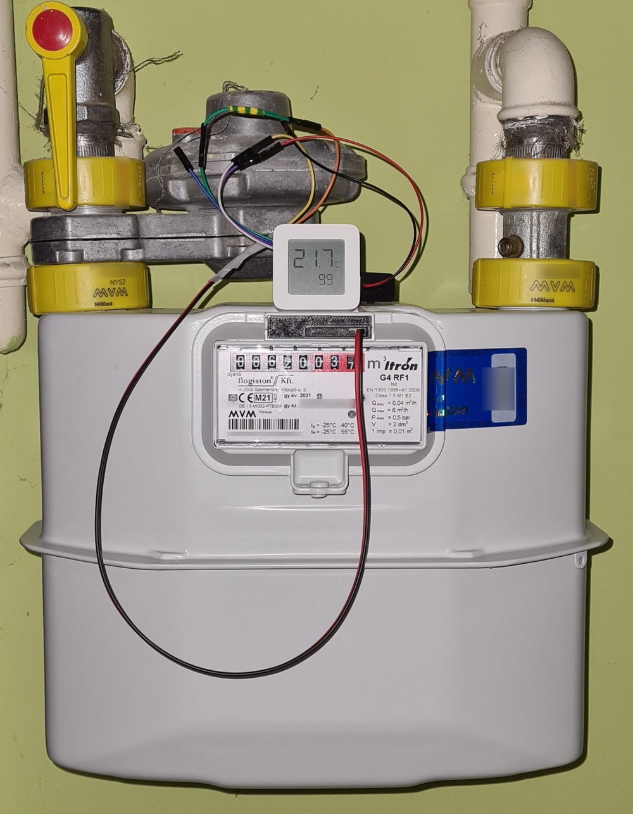

# Reed counter using a LYWSD03MMC device with pvvx firmware

Probably such a nische use case, not worth investing into.
This description is rather for you to have the use case and the ideation documented.
Main documentation is at [README.md](README.md).

## Use case
Gas meter counting using the LYWSD03MMC device.
I have started working on the code with pulse counting and sending the actual state to the BLE integration.
https://github.com/afarago/ATC_MiThermometer/tree/gasmeter_via_reed_switch

## Background
I have soldered the reed counter pin out based on your description and am using a reed switch at a gas meter to monitor gas consumption.  On the other end there is a home assistant installation that receives the data. (temp, humi and reed state)

After a few weeks of trial and error it seemed obvious that the current setup of BLE advertisements is not reliable enough to push the 1 second long closed signal reliably to the HA core.
Reason for LYWSD03MMC is that it was available and there is no AC or DC power close to the meter to enable an ESP device.

## Hardware
Gas meter has pulses every 10-20 seconds, detected by a reed switch with normally open state, with a pulse length (closed) of 0.5-1 seconds.

## Solution ideas and caveats
Based on the instruction it was easy to compile the code and get a .bin firmware file up and running. Kudos!
Everything worked fine.
I did not want to alter the BLE adv format for compatibility reasons, thus decided to sacrifice one of the fields.

- Initially thought was to sacrifice the humi field, allowing a 16 bit counter and send the accumulated data there.
However HA Passive BLE integration averages humi data, therefore an instant update is not available, only rather several 10s of delay.
- battery mV field had the very same caveat
- finally battery % is used, limiting reed counting to 0-255

- decided not to alter code with eeprom storage due to reducing complexity --> any power disconnect / battery change resets to "0"

## Solution
- a new reed counter field is introduced that is counting from 0 up to 99 and is reset (mod 100)
- ble sends this information as battery %
- advertisements can be missed, as after a state of e.g. 8 a state 12 is received Home Assistant can substract and trigger and update in with a repeat count of 12-8 = 4 [ (to_state+100 - from_state)%100 ]
- as initial value 100 is used, to make sure that the calculation loop on the HA side is not triggered after a powerup (e.g. last state was 4, initial state is 0 (100%0))

## Possible future directions
- use somehow the mV sensor to transmit global 16 bit pulse counting state to reduce server complexity.

## Home Assistant configuration

Using [Passive BLE integration](https://github.com/custom-components/ble_monitor).

```
#######################################################################
### Special ATC firmware: reed cycles are counted and a reed_count%100 
### is returned in the battery_percentage
### first entry sent is: 100 - to make sure it is not counted after "powerdown"

### BASE SENSOR #######################################################

template:
  ### ble_opening_entry_room_temp battey level attribute is updated instantly, while the battery sensor is not - unsure why
  - sensor: 
    - name: blegasmeter_relative_count
      unique_id: blegasmeter_relative_count
      state: >
        {{ state_attr('binary_sensor.ble_opening_entry_room_temp', 'battery_level') }}

  ### is gasmeter running
  - binary_sensor:
    - name: blegasmeter_running
      unique_id: blegasmeter_running
      state: >
        {{ (states['sensor.blegasmeter_relative_count'].last_changed|default) >= (utcnow()-timedelta(minutes=1)) }}
      device_class: running
      auto_off: 30

### BASE COUNTER #######################################################
automation:
  - id: "blegasmeter pulse cycle"
    alias: BLEgasmeter with Entry Room Temp Open sensor pulse
    description: "BLEgasmeter reed sensor closes (off state between 9->0 every 0.01m³ = 10l) - increase counters"
    trigger:
      - platform: state
        entity_id: sensor.blegasmeter_relative_count
        # To trigger on all state changes, but not on changed attributes, set at least one of from or to to null.
        # from: null
    condition:
      # first entry sent is: 100 - to make sure it is not counted after "powerdown"
      - condition: template
        value_template: >
          {{
            (trigger.from_state is not none) and (trigger.to_state is not none) and
            (trigger.from_state.state not in ['unknown','unavailable']) and 
            (trigger.to_state.state not in ['unknown','unavailable']) and
            (trigger.to_state.state != trigger.from_state.state) and 
            (trigger.to_state.state|int(0) < 100)
          }}
    variables:
      increment_cycles: >-
        {{ ( (trigger.to_state.state|int(0)+100) - (trigger.from_state.state|int(0)) ) % 100 }}
    action:
      - repeat:
          count: "{{ increment_cycles }}"
          sequence:
            - service: input_number.increment
              target:
                entity_id: input_number.blegasmeter_meterat

input_number:
  blegasmeter_meterat:
    min: 0
    max: 99999999
    step: 10
    name: BLEgasmeter meter state in m³/1000 = dm³ = 1 l
    unit_of_measurement: dm³
    icon: "mdi:fire"
    mode: box

```

## Photo on the gasmeter setup
Gas meter with reed - still in a prototyping setup.

